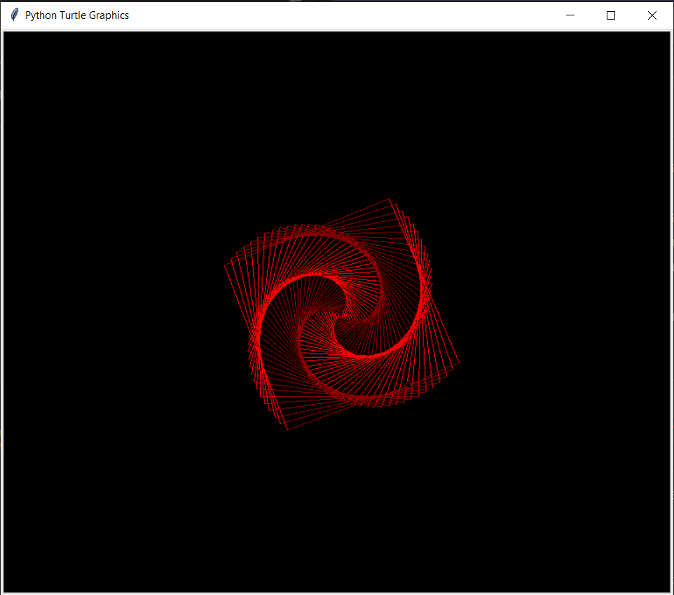

# Turtle Geometric Pattern

This Python script uses the Turtle graphics library to create a colorful geometric pattern. The turtle moves forward in a loop, changing its forward distance and turning angle to generate the pattern.

 

## Instructions

1. Install Python if not already installed: [Python Official Website](https://www.python.org/)

2. Install the Turtle graphics library (usually comes with Python installation).

3. Run the script using Python:

    ```bash
    python app.py
    ```

## Explanation

- **`import turtle`**: Import the Turtle graphics module.

- **`turtle.bgcolor('black')`**: Set the background color to black.

- **`t = turtle.Turtle()`**: Create a turtle object.

- **`colors = ['red', 'dark red']`**: Define a list of colors: red and dark red.

- **`for number in range(400):`**: Loop 400 times.

  - **`t.forward(number + 1)`**: Move the turtle forward by the current iteration number + 1.

  - **`t.right(89)`**: Turn the turtle right by 89 degrees.

  - **`t.pencolor(colors[number % 2])`**: Set the pen color based on whether the iteration number is even or odd.

- **`turtle.done()`**: Finish the turtle graphics.

---
